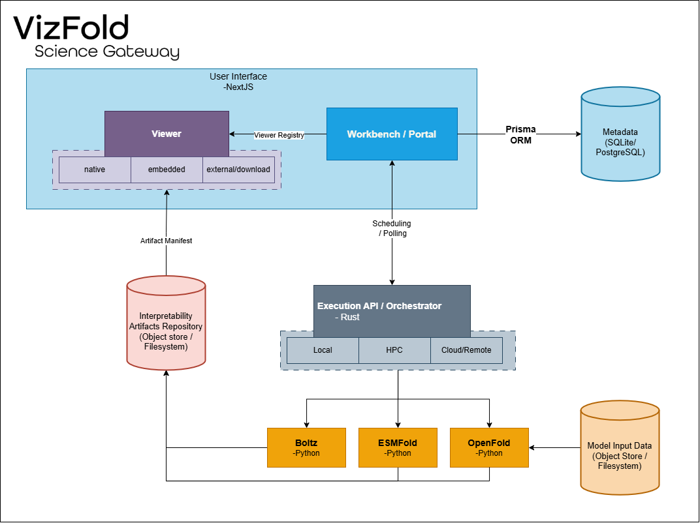
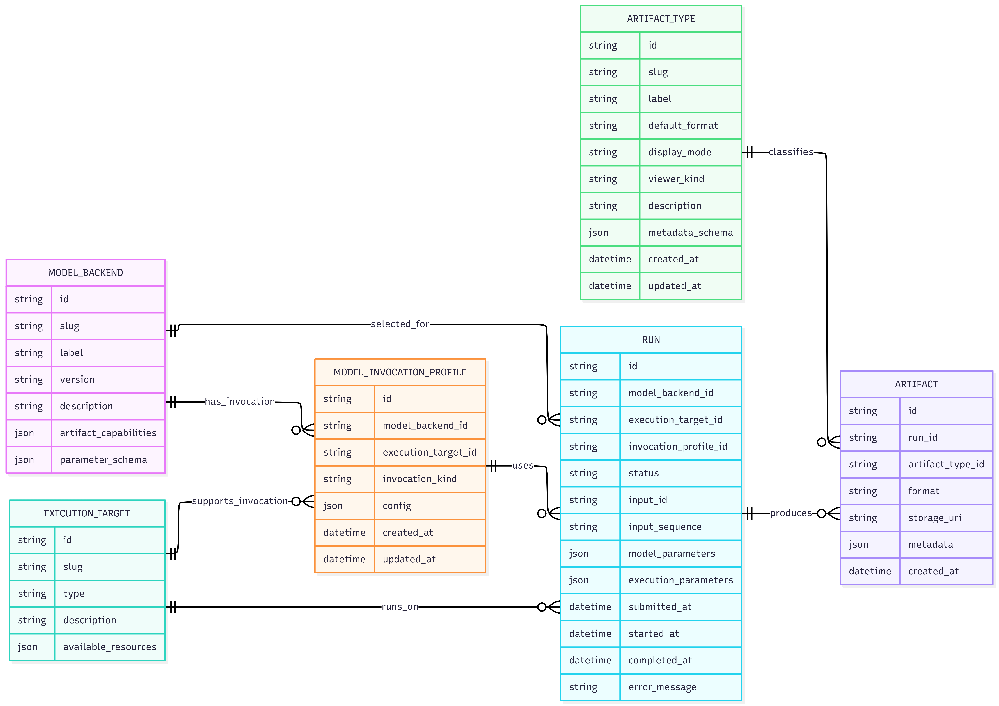
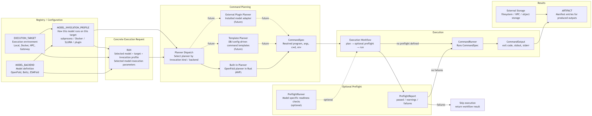

# Science Gateway Architecture



# VizFold Executor MVP Data Model



This diagram describes the MVP data model for the Rust executor core. The goal is to separate model definition, execution environment, invocation configuration, concrete runs, artifact classification, and produced artifact instances.

`MODEL_BACKEND` represents a registered model implementation, such as OpenFold, ESMFold, or Boltz. It stores model-level metadata, the model parameter schema, and the artifact types the model can theoretically produce.

`EXECUTION_TARGET` represents an environment where execution can happen, such as local runtime, Docker, HPC, or a science gateway. It stores target-level metadata and available resources/capabilities, such as supported devices, CPU bounds, GPU availability, memory/resource options, and runtime constraints. It does not store model-specific command parameters or installation details.

`MODEL_INVOCATION_PROFILE` connects a specific model backend to a specific execution target. It owns the model-target-specific invocation configuration, such as subprocess, Docker, SLURM, or gateway invocation details. This prevents model-specific paths or command templates from leaking into the generic execution target definition.

`RUN` represents one concrete execution request. It selects a model backend, execution target, and invocation profile, then records the concrete model selections and run-time execution/input choices for that run. `RUN.input_id` is the stable model-facing input identity for the run. For OpenFold, this is intended to become the canonical FASTA record ID/header tag, default alignment key, and artifact filename prefix. It should not be mutated for workspace/output collision handling; use run/workspace identifiers for that instead.

`ARTIFACT_TYPE` represents catalog/reference data for known artifact kinds that the executor or visualization layer may understand, such as protein structures, attention heatmaps, PyMOL sessions, trace archives, or manifests. It stores stable type metadata including a slug, default format, display mode, viewer kind, description, and optional metadata schema. This separates artifact classification and visualization hints from concrete produced artifact instances.

`ARTIFACT` represents a manifest entry for a concrete output produced by a run. It references an `ARTIFACT_TYPE`, records the concrete produced format, storage URI, and artifact metadata. The database records what artifact exists and where it is stored, while the heavy scientific output files remain in external storage such as the filesystem, HPC storage, or object storage.

This model intentionally does not include model-target artifact constraint logic in the MVP. Artifact capabilities remain model-level, while actual produced outputs are recorded as `ARTIFACT` rows classified by the `ARTIFACT_TYPE` catalog.

The artifact type catalog exists to provide stable artifact metadata and display hints. Actual post-run artifact discovery, output scanning, file serving, and dashboard/viewer wiring are intentionally deferred.

## Architecture note: parameter and resource ownership

The current MVP has one model-facing parameter schema and one target-level resource description:

- `ModelBackend.parameter_schema_json`
- `ExecutionTarget.available_resources_json`

`Run` has two concrete parameter buckets with distinct responsibilities:

| Column | Intended meaning |
| --- | --- |
| `Run.model_parameters_json` | Explicit model-argument values or overrides selected for this run, such as an OpenFold preset or model feature flag. The allowed arguments, types, CLI flags, and defaults are defined by `ModelBackend.parameter_schema_json`; schema defaults may be applied when a value is omitted here. This column is not redundant with the schema: it preserves the run's chosen model values. |
| `Run.execution_parameters_json` | Run-scoped input, runtime, and resource choices consumed by schema entries sourced from `execution_parameters`, such as FASTA/alignment inputs, the current `data_dir`, device selection, or CPU count. Target resources constrain these values through `ExecutionTarget.available_resources_json`. It must not carry invocation-profile configuration or normalized output paths. |

Resolved output locations are derived from `ModelInvocationProfile.config_json.output_location` and `Run.id`, rather than being stored as `output_dir` or `attn_map_dir` execution parameters.

The target resource description must not be treated as a competing model-command parameter schema.

A cleaner model may be:

1. `ModelBackend` owns the canonical model parameter contract. It defines the parameters a backend supports, their meaning, and where their values should be sourced from.

2. `ModelInvocationProfile` owns backend-target invocation configuration in `config_json`, such as local paths, remote paths, program/script configuration, environment variables, and target-specific output locations. It does not currently define a separate parameter schema. If backend-target-specific run requirements are needed later, they should be added deliberately with a clear name and design rather than a generic unused wildcard field.

3. `ExecutionTarget` describes runtime capabilities/resources rather than model-specific command parameters. For example, GPU availability, CPU limits, supported execution type, or resource constraints.

Under this direction, model-specific CLI flags such as OpenFold `--attn_map_dir` should not live on a generic execution target. Output paths are resolved from the invocation profile rather than supplied as unrelated run execution parameters.

`ExecutionTarget.available_resources_json` is the current target-level field for these capabilities. The OpenFold workflow uses it to constrain the concrete resource values selected in `Run.execution_parameters_json`.

## Executor Architecture Flow



The executor separates registration, planning, optional preflight, execution, and artifact recording. `MODEL_BACKEND` defines what model exists, `EXECUTION_TARGET` defines where execution can happen, and `MODEL_INVOCATION_PROFILE` defines how a specific model runs on a specific target.

For a concrete `RUN`, the executor loads the selected model, target, invocation profile, and parameters. A planner then converts those records into a `CommandSpec`, which is the final resolved execution plan containing the program, arguments, working directory, and environment variables.

Before execution, the command may pass through an optional `PreflightRunner`. A preflight runner performs model-specific readiness checks for the selected execution target environment and returns a `PreflightReport` with passed checks, warnings, or failures. If no preflight runner is available, the workflow can proceed directly to execution. If preflight failures are reported, execution is skipped and the workflow returns the report.

The `ExecutionWorkflow` coordinates this flow: `CommandSpec` → optional `PreflightRunner` → `CommandRunner`. The `CommandRunner` executes the command and returns a `CommandOutput` containing the exit code, stdout, and stderr.

For the MVP, OpenFold can be supported through a built-in Rust planner and an optional OpenFold preflight runner. Later, the same abstractions can support DB-driven command templates, external model plugins, richer preflight checks, and additional execution targets without changing the core execution flow. Produced outputs are not stored directly in the database; they remain in external storage and are registered as `ARTIFACT` manifest entries classified by the `ARTIFACT_TYPE` catalog. `ARTIFACT_TYPE` is catalog/reference data. `ARTIFACT` is run-specific manifest data.

### Schema parameter sources

`ModelBackend.parameter_schema_json` is the canonical contract for model-native arguments: it declares argument types, CLI flags, defaults, and where the planner obtains a value. A schema describes what a backend accepts; the selected run values remain in the `RUN` record for reproducibility.

The current OpenFold source vocabulary is:

| Source | Resolution |
| --- | --- |
| model parameter (no `source`) | Read from `Run.model_parameters_json`, falling back to a schema default when present. |
| `execution_parameters` | Read the named `parameter` from `Run.execution_parameters_json`. |
| `data_dir` | Read `data_dir` from `Run.execution_parameters_json` and join the declaration's `relative_path`. |
| `invocation_profile_config` | Read the named `parameter` from `ModelInvocationProfile.config_json`. An optional `relative_path` is joined after resolution. |
| `run_output_workspace` | Resolve `ModelInvocationProfile.config_json.output_location / Run.id`. An optional `relative_path` is joined after resolution. |

For example, OpenFold's normalized output arguments are declared in the model schema rather than emitted as planner-specific special cases:

```json
{
  "output_dir": {
    "type": "path",
    "source": "run_output_workspace",
    "cli_flag": "--output_dir"
  },
  "attn_map_dir": {
    "type": "path",
    "source": "run_output_workspace",
    "relative_path": "attention",
    "cli_flag": "--attn_map_dir"
  }
}
```

`invocation_profile_config` enables direct profile-owned values such as a target-specific `data_dir`. It is available to schema declarations but is not yet used by the OpenFold parameter schema; current `data_dir` behavior remains unchanged.

### Output location resolution

The executor should maintain a normalized output location concept that is independent of model-native argument names.

`ModelInvocationProfile.config_json.output_location` defines the base output location for a specific backend-target invocation. A concrete run resolves its output workspace using the run identifier:

```text
resolved_output_location = invocation_profile.output_location / run.id
```
Model-specific command planning maps this resolved location to the backend-native argument. For OpenFold, the resolved output location maps to `--output_dir`, and the attention directory is derived as `<resolved_output_location>/attention` for `--attn_map_dir`.

Model-specific secondary output paths, such as OpenFold attention map directories, should be derived from the resolved run output location where possible rather than supplied as unrelated top-level paths.

This keeps:

- ModelInvocationProfile responsible for target-specific location conventions;
- Run responsible for the concrete run identity and selected parameters;
- artifact registration responsible for indexing produced files under the resolved output location.
